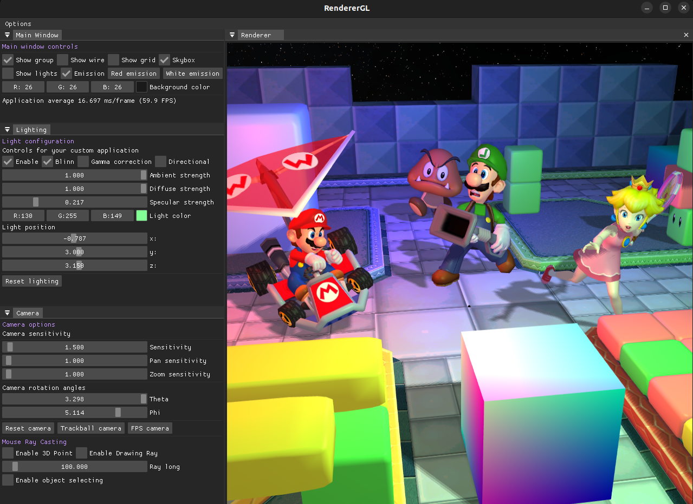
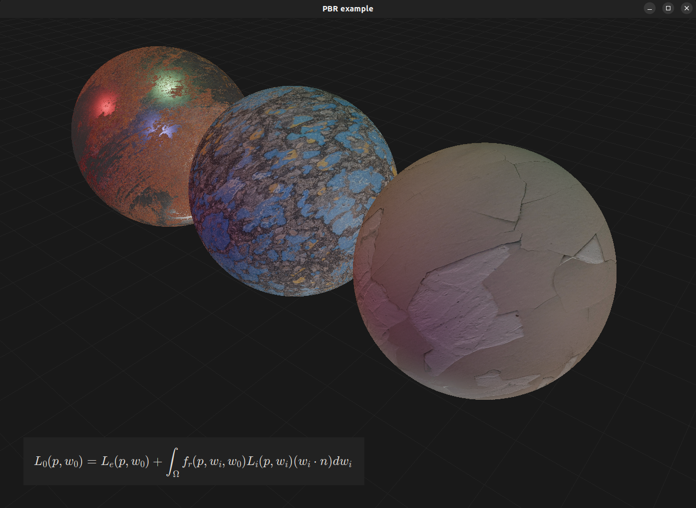

# RendererGL

RendererGL is a basic 3D renderer written in C++ and OpenGL that allows working with 3D graphics without the need to know computer graphics or OpenGL. So that both beginners and more experienced programmers can create a 3D scene with lighting, shadows and materials.

> **Warning** This project is still under development

Take a look at some [screenshots](#screenshots)

## Features

* **Trackball and first person shooter camera**
* **Anti aliasing (MSAA)**
* **Textures**
* **Load 3D models and textures from files**
* **Skybox (cubemap)**
* **FrameCapturer:** create a texture of the scene
* **Blinn-Phong lighting:** Ambient, Diffuse, Specular, Emission
* **Physically Based Rendering (PBR):** Albedo, Metallic, Normal, Roughness, Ambient Occlusion, Emission
* **Shadow Mapping:** percentage closer filtering
* **Normal Mapping**
* **Gamma correction**
* **HDR**
* **Mouse ray casting:** object selection

### Scene Graph

A [scene graph](https://en.wikipedia.org/wiki/Scene_graph) is a general data structure which arranges the logical and often spatial representation of a graphical scene. It is a collection of nodes in a graph or tree structure:

* **Polytope:** A set of vertices and indices (optional) that defines a shape
* **Group:** A set of polytopes
* **Model:** A group which contains a set of polytopes that are loaded from a file (*.obj*, *.dae*, *...*)
* **Scene:** Contains a set of groups, models and other scenes
* **Renderer:** Contains a set of scenes. It's the one who deals with all the graphics stuff

*Take a look at the example below*

## Example: rotating cube

```cpp
#include <iostream>
#include <vector>

#include <engine/renderer/Renderer.h>
#include <engine/renderer/TrackballCamera.h>

#include <GLFW/glfw3.h>

const int WIDTH = 1280;
const int HEIGHT = 900;
GLFWwindow* window;

Renderer::Ptr renderer;

// x y z  r g b
std::vector<Vec3f> cubeVertices {
    Vec3f(-0.5, -0.5,  0.5,   0.0f, 0.0f, 1.0f),
    Vec3f( 0.5, -0.5,  0.5,   1.0f, 0.0f, 1.0f),
    Vec3f( 0.5,  0.5,  0.5,   0.0f, 1.0f, 1.0f),
    Vec3f(-0.5,  0.5,  0.5,   0.0f, 1.0f, 0.5f),
    Vec3f(-0.5, -0.5, -0.5,   0.0f, 0.0f, 1.0f),
    Vec3f( 0.5, -0.5, -0.5,   1.0f, 0.0f, 1.0f),
    Vec3f( 0.5,  0.5, -0.5,   0.0f, 1.0f, 1.0f),
    Vec3f(-0.5,  0.5, -0.5,   0.0f, 1.0f, 0.5f)
};

std::vector<unsigned int> cubeIndices {
    0, 1, 2,  1, 5, 6,  7, 6, 5,
    2, 3, 0,  6, 2, 1,  5, 4, 7,
    4, 0, 3,  4, 5, 1,  3, 2, 6,
    3, 7, 4,  1, 0, 4,  6, 7, 3 
};

int main() {

    // Create window
    if (!glfwInit()) {
        std::cout << "Couldn't initialize window" << std::endl;
        return -1;
    }

    window = glfwCreateWindow(WIDTH, HEIGHT, "Cube example", NULL, NULL);
    
    if (!window) glfwTerminate();

    glfwMakeContextCurrent(window);

    // Renderer
    renderer = Renderer::New(WIDTH, HEIGHT);

    double aspectRatio = static_cast<double>(WIDTH) / HEIGHT;
    TrackballCamera camera = TrackballCamera::perspectiveCamera(glm::radians(45.0f), aspectRatio, 0.1, 1000);
    camera.zoom(-2.5);

    renderer->setCamera(camera);

    // Scene
    Polytope::Ptr polytopeCube = Polytope::New(cubeVertices, cubeIndices);

    Group::Ptr group = Group::New();
    group->add(polytopeCube);

    Scene::Ptr scene = Scene::New();
    scene->addGroup(group);

    renderer->addScene(scene);

    // Main loop
    while (!glfwWindowShouldClose(window)) {

        // Update scene
        polytopeCube->rotate(0.55, glm::vec3(1, 0, 1));

        // Draw scene
        renderer->clear();
        renderer->render();
        
        // Update window
        glfwSwapBuffers(window);
        glfwPollEvents();
    }

    // Destroy window
    glfwTerminate();

    return 0;
}
```

## Screenshots

**Multiple point lights (Blinn-Phong)**


**Shadow Mapping**



**PBR Materials**



**Emission**


**Call of Duty Ghost dog**


## Contribution

RendererGL is an open source project under the MIT licence. Feel free to fork it and contribute

## Compilation

`CMake` is required for compilation. Take a look at [compile.md](compile.md)

## Dependencies

* [GLEW](https://github.com/nigels-com/glew) for loading OpenGL extensions
* [GLM](https://github.com/g-truc/glm) for linear algebra stuff
* [ASSIMP](https://github.com/assimp/assimp) for loading 3D models from files (*.obj*, *.dae*, *...*)
* [STB](https://github.com/nothings/stb) for loading images from files (*.png*, *.tga*, *.jpg*, *...*)

Optional dependencies used in tests:

* [GLFW](https://github.com/glfw/glfw) for creating a window with an OpenGL context
* [ImGui](https://github.com/ocornut/imgui) for GUI

## References

Dealing with OpenGL was much easier thanks to:

* [Learn OpenGL](https://learnopengl.com/)
* [The Cherno](https://www.youtube.com/@TheCherno)
* [ThinMatrix](https://www.youtube.com/@ThinMatrix)
* [Physically Based Rendering: From Theory to Implementation](https://www.pbr-book.org/)